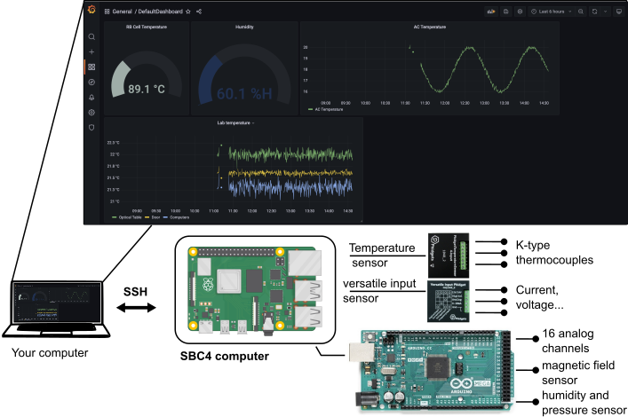

# Experiment Monitoring Software

A software package for automated monitoring of lab equipment, including time series visualization and automatic e-mail alerts.

## Architecture

A central server (which runs on the SBC4 mini-computer) gathers data from different sources (sensors connected to an Arduino or Phidgets sensors), writes them into a database, hosts a graphic interface for visualization and can send automatic alert e-mails based on user-defined criteria.

## Currently supported interfaces
Currently, the following sensors were developed:
  * [Phidget](https://www.phidgets.com/) sensors among which [thermocouple module](https://www.phidgets.com/?tier=1&catid=107&pcid=87&srsltid=AfmBOoqE0RofYzJXlaJsIExe5Ua3yuo6_WfFnwQqtDnHt1VYG4GnHzBl), voltage input, current input;
  * Analog channels, via the analog to digital channels (ADC) on the Arduino board;
  * Humidity and temperature sensor AHT10 (connected to the Arduino board);
  * Socket protocol to address scientific instruments such as oscilloscopes;
  * Temperature sensor MAX31865;
  * Magnetic field sensor QMC5883L;

## Setup

  * Before starting the Experiment Monitoring, you need to set up your server. For hardware requirements & the step-by-step server setup procedure, see [`docs/server_setup.md`](docs/server_setup.md).
  * If you want to work with existing interfaces, you need to:
    * Install the upload the Arduino code on your Arduino. See [`src/expmonitor/classes/arduino.md`](src/expmonitor/classes/arduino.md).
    * Config your setup in the [`src/expmonitor/config.py`](src/expmonitor/config.py).
  * If you want to add a new sensor and write your own interfaces:
    * Write a subclass that extends the abstract `Sensor` class defined in [`src/expmonitor/classes/sensor.py`](src/expmonitor/classes/sensor.py) to drive your sensor/equipment and instantiate it in `src/expmonitor/config.py`. See examples in the `src/expmonitor/classes` folder. If your sensor performs more than one measurement, use the `MultiSensor` class.  
  

## Guide to the repository structure:

  * `src/expmonitor/calibrations`: Contains calibration data and scripts for all calibrated equipment.
  * `src/expmonitor/classes`: Contains driver classes for all interfaces. Put your new driver classes in here.
    * `src/expmonitor/classes/sensor.py`: Abstract base class for individual sensor classes.
    * `src/expmonitor/classes/phidget_tc.py`: Abstract base class for individual sensor classes.
  * `tests`: Contains tests for the Phidget class.
  * `src/expmonitor/utilities`: Contains interface-independent classes to be used by all sensors.
    * `src/expmonitor/utilities/spike_filter.py`: Spike filter for instances of Sensor subclasses. Enable in `src/expmonitor/config.py` by setting `sensor.spike_filter.spike_threshold_perc` for any given sensor.
  * `src/expmonitor/config.py`: Main configuration file.
  * `src/expmonitor/exec.py`: Main execution file for Linux service and command line execution. Use it to test single or multiple (e.g. <i>5</i>) iterations of the data acquisition cycle:
    <pre>
    python3 /mnt/code/experiment-monitoring/src/expmonitor/exec.py t v <i>5</i>
    </pre>
    Note that the argument after the script filepath sets the number of executions of the loop. The t and v flags enable timing and exception traceback to stdout.

