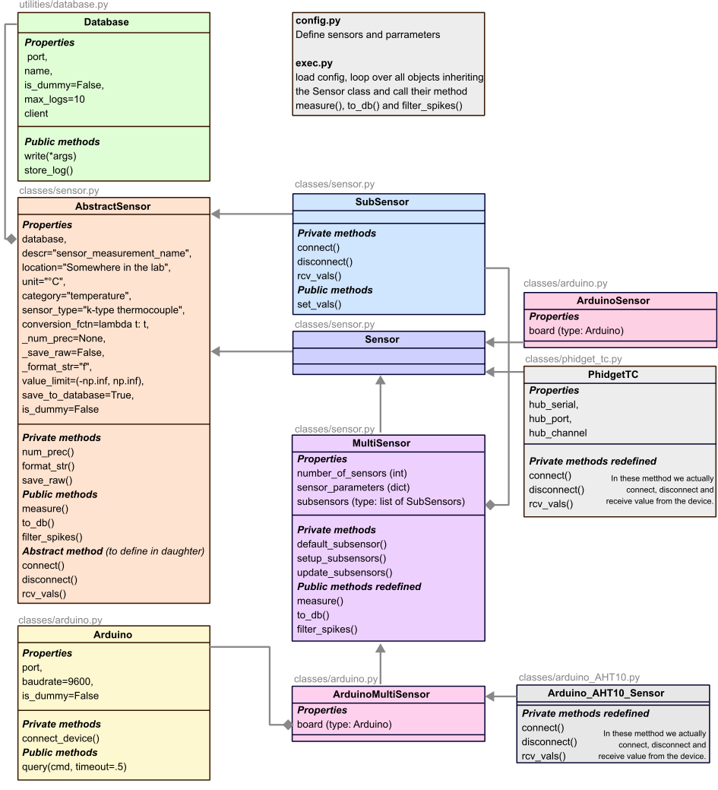

# How to run the code ?
We only run the `exec.py` file. This code import the config.py in which each experiment must implements its configuration: the configuration depends on the hardware of the experiment of course (i.e. if an Arduino board is connected, to which sensors the board is connected...).

Once imported the config file, the code loop over all classes of kind Sensor which are declared in the config file. This is why any sensor (anything that do measurement(s) must inherit the Sensor class). The exec file loop over all instanciated sensors of the code and call the following methods of the Sensor:
* `measure()`, i.e. perform the actual measurement,
* `to_db()`, i.e. write measurement to database,
* `filter_spikes()`, i.e. take out spikes. For now, we have removed this function (you can try to reimplement it of course).

# What is a sensor?

A Sensor, defined in the [classes/sensor.py](../src/expmonitor/classes/sensor.py) file, is the base object of our code. There exist two kinds of sensor objects and both inherit from the AbstractSensor class in which most of common properties are implemented. 
* Sensor: a Sensor only performs a single measurement and add it to the database. Currently, the Sensor class mostly inherits all its method and attributes from the AbstractSensor class. When implementing a new Sensor, you only need to redefine three abstract methods. All these methods are called within the `measure()` method, in the following order:
  * `connect()` – first called, it connects to the physical device. Note that if the connection was already made in the instantiation, this method could just check that the device is still here.
  * `rcv_vals()` – second method called, it must return the value from the sensor. For example, a [phidget sensor](../src/expmonitor/classes/phidget_tc.py) will simply call the `getTemperature()` method of the `Phidget22.Devices.TemperatureSensor` object on a given port and hub.
* MultiSensor: a MultiSensor performs different measurements (for example, it can measure both the temperature and the humidity with a AHT10 Arduino sensor. It could also measure all analog channels of the Arduino board.). The MultiSensor inherit the Sensor class (because it is the one that will be instantiated in the config file) but we have redefined some of its function as it takes many measurements. In particular, it possesses a list of subsensors. Theses subsensors do not inherit the Sensor class which means the exec file will not individually call their `measure()`, `to_db()` and `filter_spike()` methods. Instead, the MultiSensor will loop over it subsensor list to perform the measurement of each of its subsensors.

A sensor must send data to the database, therefore it takes as an argument the [influxDB database](src/expmonitor/utilities/database.py), defined in [utilities/database.py](src/expmonitor/utilities/database.py) 

We provide below the UML chart of the code. An arrow indicates that an object inherit from the class and a square connection means the linked class is an attribute of the object. 

